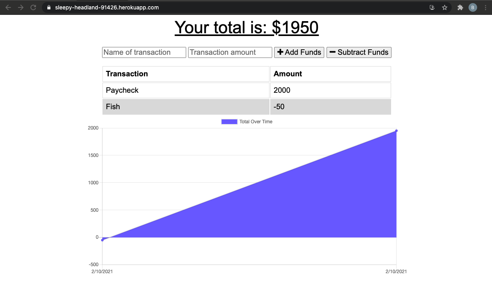

  # Budget

  

  ## Description

  This project was just a copy and paste project and was designed to teach us how to make a websight into a PWA. None of this is my original work.

  ## Images

<a href="https://sleepy-headland-91426.herokuapp.com/">Deployed Link</a>
  
  ## Table of Content

  * [Installation](#installation)

  * [Usage](#usage)

  * [License](#license)

  * [Contributing](#contributors)

  * [Contact](#questions/contact)

  ## Installation

  To Install necessary dependencies, run the following command:
  
  npm install

  ## Usage

      "Click Buttons"
  
  ## Technologies

      HTML,CSS,JavaScrypt, express, mongoose

  ## Contributors

  UW coding bootcamp + Ben Hopkins

  ## Questions/Contact

  <a href="https://github.com/bh007183">GitHub Profile</a>
  <a href="mailto:bjhops17@gmail.com"> Email Me</a>
  
  

  